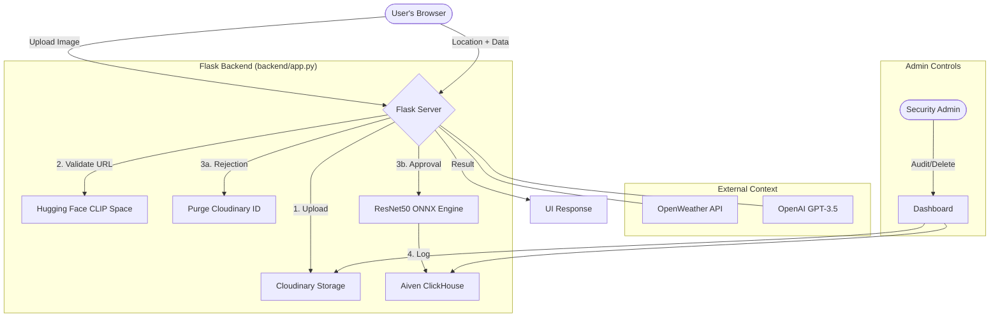

# Wheat Disease Intelligence Platform

> Production-style web platform for wheat disease detection with contextual AI recommendations.

**[Live Demo](https://wheat-detection-es09.onrender.com/)**

---

## Why This Project Matters

Most crop-disease demos stop at a class label. This system goes further:

2. Detects disease from image using a quantized ResNet50 model (89% accuracy, 15 classes)
3. Collects field context — questionnaire, real-time weather, geolocation
4. Generates practical treatment guidance using an LLM
5. Captures user feedback and stores labeled images for a future retraining pipeline

This demonstrates end-to-end engineering across ML inference, backend architecture, cloud storage, managed database integration, and product UX — not just a notebook experiment.

---

## Architecture



### Flow Logic
1. **Cloud-First Validation**: Every upload hits Cloudinary first to generate a persistent URL for downstream microservices.
2. **CLIP Gatekeeper**: The Hugging Face microservice analyzes the URL. If the "Wheat Score" is below the threshold, the backend immediately calls `destroy()` on the Cloudinary image to minimize storage footprint.
3. **ResNet50 Inference**: Only validated wheat photos reach the classification model.
4. **Data Integrity**: Predictions are stored in Aiven ClickHouse for high-speed retrieval of historical disease patterns.


---

## Core Features

- **Multi-Stage AI Validation (CLIP Gatekeeper)** — Uses a specialized CLIP microservice to validate images before processing. If an image is not a wheat crop, it is automatically rejected and purged from storage to save costs and maintain data quality.
- **Microservice Architecture** — Decoupled CLIP validation hosted on Hugging Face Spaces for efficient resource management.
- **High-Accuracy Inference** — Quantized ResNet50 ONNX model, 89% top-1 accuracy across 15 wheat disease classes
- **INT8 Quantization** — Model size reduced from 90MB to 22.6MB (75% reduction), faster cold-starts on CPU deployment
- **Human-in-the-Loop Feedback** — Users confirm or correct predictions; labeled images stored for future retraining
- **Admin Monitoring Dashboard** — Secure `/admin` interface for auditing predictions, monitoring system health, and manual data purging.
- **Cloud-Native Persistence** — Seamless integration with Cloudinary for asset management and Aiven ClickHouse for high-performance telemetry storage.
- **Context-Aware Recommendations** — Real-time weather + geolocation fed to GPT-3.5-Turbo for field-specific guidance
- **PDF Report Export** — Downloadable diagnostic report with image, prediction, and treatment plan
- **Responsive UI** — Mobile-first design with Tailwind CSS for field access

---

## Tech Stack

| Layer | Tools |
|---|---|
| Backend | Flask, Flask-SQLAlchemy, Uvicorn / ASGI |
| ML | PyTorch (training), ONNX, ONNX Runtime |
| Storage | Cloudinary (images), Aiven ClickHouse (feedback records) |
| Intelligence | OpenAI GPT-3.5-Turbo, WeatherAPI, GeoIP2 |
| Reporting | ReportLab (PDF generation) |
| Deployment | Docker, Render |

---

## ML Pipeline

### Model: ResNet50

ResNet50 is a strong fit for this problem:
- Residual connections give stable training on limited data
- Good accuracy/latency tradeoff for 224×224 crop images
- Mature ONNX export and Runtime ecosystem
- Easily portable to CPU-only production environments

**Achieves 89% top-1 accuracy across 15 wheat disease classes.**

### Optimization Pipeline

```
Train in PyTorch (ResNet50 classifier)
  -> Export to ONNX          [convert_to_onnx.py]
  -> Simplify ONNX graph     [optimize_onnx.py]
  -> INT8 dynamic quantization [quantize_onnx.py]
  -> Serve with ONNX Runtime
```

INT8 quantization via `onnxruntime.quantization.quantize_dynamic` (weight_type=QUInt8):
- 75% model size reduction (90MB → 22.6MB)
- Lower CPU memory pressure
- Better inference throughput on CPU-heavy deployments

## Cloudinary + ClickHouse: How Images and Labels Are Linked

Every uploaded image is stored in Cloudinary. The returned `secure_url` is saved directly into the ClickHouse feedback record — this URL is the link between the image asset and its label.

**Feedback schema:**

| Field | Type | Description |
|---|---|---|
| id | UUID | Primary key |
| image_url | String | Cloudinary secure URL |
| predicted_class | String | Model's output |
| correct_class | String (nullable) | User-corrected label if flagged |
| is_correct | Boolean | User confirmation |
| created_at | DateTime | Timestamp |

This creates a reliable audit trail: prediction request → cloud image → persisted labeled record.

To reconstruct a training dataset from collected feedback:

```python
SELECT image_url, correct_class FROM feedback
# Download each image, save to dataset/{correct_class}/filename.jpg
# PyTorch ImageFolder reads folder names as class labels directly
```

---

## Project Structure

```
/
├── backend/
│   ├── app.py                          # Main ASGI/Flask application
│   ├── models.py                       # Feedback schema (ClickHouse via SQLAlchemy)
│   ├── utils.py                        # OpenAI + Weather integrations
│   ├── location.py                     # Geolocation logic
│   ├── convert_to_onnx.py              # PyTorch → ONNX export
│   ├── optimize_onnx.py                # ONNX graph simplification
│   ├── quantize_onnx.py                # INT8 dynamic quantization
│   ├── wheat_resnet50_quantized.onnx   # Production model
│   ├── templates/                      # Jinja2 HTML templates
│   └── static/                         # Tailwind CSS, JS, uploads
├── docs/                               # Feature documentation
├── Dockerfile
└── README.md
```

---

## Run Locally

**Prerequisites:** Python 3.10+, OpenAI API key, WeatherAPI key, Cloudinary account, Aiven ClickHouse instance

```bash
git clone https://github.com/rautaditya2606/wheat_detection.git
cd wheat_detection/backend
pip install -r requirements.txt
```

Create `backend/.env`:

```
OPENAI_API_KEY=your_openai_key
WEATHER_API_KEY=your_weather_key
CLOUDINARY_CLOUD_NAME=your_cloud_name
CLOUDINARY_API_KEY=your_cloudinary_key
CLOUDINARY_API_SECRET=your_cloudinary_secret
DATABASE_URL=your_aiven_clickhouse_url
SECRET_KEY=your_secret_key
```

```bash
python app.py
# http://localhost:10000
```

---

## Roadmap

- **Active learning pipeline** — scraped and user-corrected images stored in Cloudinary + ClickHouse, exported as an `ImageFolder`-compatible dataset for periodic fine-tuning
- **CI/CD triggered retraining** — GitHub Actions workflow that triggers fine-tuning automatically when verified sample count crosses a class threshold, exports updated ONNX model
- **Incremental fine-tuning** — new data mixed with original dataset samples to prevent catastrophic forgetting
- **Model observability** — latency tracking, confidence distribution monitoring, and class-level prediction drift detection
- **Dataset versioning** — track which feedback samples were used in each retraining run via `used_in_training` flag

---

Built by: [Aditya Raut](https://github.com/rautaditya2606) 
