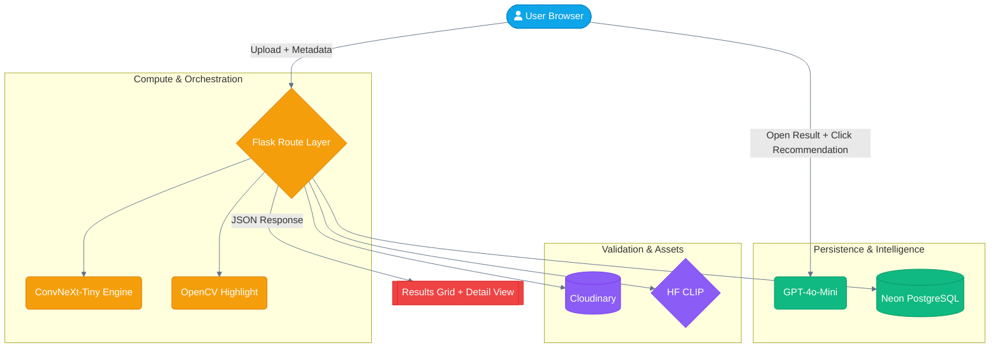

# Wheat Disease Intelligence Platform

> Production-style web platform for wheat disease detection with contextual AI recommendations.

**[Live Demo](https://wheat-disease-detection.onrender.com/)**

---

## Why This Project Matters

Most crop-disease demos stop at a class label. This system goes further:

1. **Stable Bulk Diagnostics (Up to 10 Images)**: Upload up to 10 images in one request. The backend processes each image sequentially (Cloudinary -> CLIP validation -> ONNX inference -> overlay) for predictable behavior on low-resource deployments.
2. **Heuristic Region Overlays**: Automatically generates visual disease highlighting using OpenCV-based color and texture analysis (e.g., reddish-brown rust pustules) to ground the model's prediction in visual evidence.
3. **On-Demand AI Recommendation**: Bulk analysis focuses on fast, stable classification. Users open an image result and click **Get Expert Recommendations** on `/result` to generate personalized guidance.
4. **Edge-Optimized ConvNeXt Engine**: Uses an INT8 quantized ConvNeXt-Tiny model (88.3% accuracy) optimized for CPU inference with minimal accuracy drop (+0.0018).
5. **Human-in-the-Loop Feedback**: Captures user-corrected labels and stores them in Neon PostgreSQL, creating a verifiable ground-truth dataset for future active learning cycles.

This demonstrates end-to-end engineering across ML inference, backend architecture, cloud storage, managed database integration (PostgreSQL), and product UX — not just a notebook experiment.

---

## Architecture


### Flow Logic
1. **Single or Bulk Upload**: User uploads 1 image (`/predict`) or up to 10 images (`/predict-bulk`).
2. **Sequential Processing**: Each bulk image is processed in-order for stability in deployment environments.
3. **Validation First**: Cloudinary URL is created, then CLIP verifies wheat content; non-wheat images are rejected.
4. **Visual Diagnosis**: OpenCV heuristics generate highlighted overlays for infected regions.
5. **Recommendation on Demand**: AI recommendation is requested from the result page when the user clicks the recommendation button.

---

## Core Features

- **Stable Bulk Upload (Up to 10 Images)** — A simple and deployment-friendly bulk endpoint (`/predict-bulk`) that processes images sequentially and returns a unified JSON response.
- **Heuristic Disease Highlighting** — Visual overlays for 15+ diseases. Uses OpenCV color-masking and edge detection to show the user exactly where the model's prediction aligns with visual symptoms.
- **Mobile-Perfect Responsiveness** — Optimized Tailwind UI with adaptive grids (2-column mobile, 4-column desktop) and touch-optimized navigation for field use.
- **Multi-Stage AI Validation (CLIP Gatekeeper)** — Uses a specialized CLIP microservice to validate image content before full processing. Non-wheat images are automatically rejected and purged from storage.
- **High-Accuracy ConvNeXt Inference** — ConvNeXt-Tiny (clean variant) achieving **88.46% Test Accuracy** and **0.9896 AUC** across 15 wheat classes.
- **Efficient INT8 Quantization** — Precision-aware INT8 quantization maintains near-parity with FP32 results (only 0.0018 accuracy drop) while optimizing for CPU environments.
- **Context-Aware Recommendations** — Generated on demand from the result page (`/result`) using weather + user questionnaire + detected disease context.
- **Admin Monitoring Dashboard** — Secure `/admin` interface for auditing predictions and monitoring system health.

---

## Model Performance Analysis

The platform is powered by a **ConvNeXt-Tiny** architecture, quantized to INT8 for production efficiency.

### Core Metrics (Test Set)

| Metric | Score |
| :--- | :--- |
| **Accuracy** | 88.46% |
| **Precision** | 88.43% |
### Core Metrics (Test Set)

| Metric | Score |
| :--- | :--- |
| **Accuracy** | 88.46% |
| **Precision** | 88.43% |
| **Recall** | 88.46% |
| **F1 (Weighted)** | 88.38% |
| **AUC** | **0.9896** |

### Per-Class F1 Scores (Test Set)

| Class | F1-Score | Class | F1-Score |
| :--- | :--- | :--- | :--- |
| **Yellow Rust** | 0.9876 | **Common Root Rot** | 0.8814 |
| **Fusarium** | 0.9538 | **Aphid** | 0.8649 |
| **Mildew** | 0.9504 | **Mite** | 0.8430 |
| **Healthy** | 0.9457 | **Blast** | 0.8398 |
| **Septoria** | 0.9444 | **Black Rust** | 0.7939 |
| **Brown Rust** | 0.9206 | **Leaf Blight** | 0.7273 |
| **Stem Fly** | 0.9020 | **Tan Spot** | 0.6500 |
| **Smut** | 0.8874 | | |

### Training Parameters

| Parameter | Value |
| :--- | :--- |
| **Model** | ConvNeXt-Tiny (Clean) |
| **Epochs** | 30 |
| **Batch Size**| 8 |
| **Learning Rate** | 0.0001 |
| **Device** | CUDA |

### Quantization Results (INT8)

| Metric | FP32 | INT8 | Drop |
| :--- | :--- | :--- | :--- |
| **Accuracy** | 0.8846 | 0.8828 | **0.0018** |
| **Model Size** | 109.1 MB | **27.0 MB** | **75.2% Reduction** |

### Inference Benchmarks (CPU)

Measured on local CPU environment comparing previous ResNet50 base with current ConvNeXt-Tiny INT8:

| Metric | ConvNeXt-Tiny (INT8) | Status |
| :--- | :--- | :--- |
| **Avg Latency** | 65.30 ms | Fast (<100ms) |
| **Model Memory** | 46.97 MB | Lean |
| **Total RSS** | 141.87 MB | Deployment-Ready |
| **Accuracy Drop** | 0.18% | negligible |

## Model Performance Analysis

The underlying ConvNeXt-Tiny model achieves high precision across 15 wheat classes.

### Normalized Confusion Matrix (Test Set)

| Actual \ Pred | Aph | BRu | Bla | Bro | Cra | FHB | Hea | LB | Mil | Mit | Sep | Smu | SF | TS | YR |
| :--- | :--- | :--- | :--- | :--- | :--- | :--- | :--- | :--- | :--- | :--- | :--- | :--- | :--- | :--- | :--- |
| **Aphid** | **0.85** | 0.00 | 0.01 | 0.01 | 0.01 | 0.00 | 0.02 | 0.02 | 0.01 | 0.05 | 0.00 | 0.00 | 0.01 | 0.02 | 0.00 |
| **Black Rust** | 0.02 | **0.80** | 0.02 | 0.11 | 0.00 | 0.00 | 0.03 | 0.03 | 0.00 | 0.00 | 0.00 | 0.00 | 0.00 | 0.00 | 0.00 |
| **Blast** | 0.00 | 0.00 | **0.85** | 0.00 | 0.04 | 0.02 | 0.01 | 0.03 | 0.01 | 0.00 | 0.00 | 0.01 | 0.00 | 0.01 | 0.00 |
| **Brown Rust** | 0.00 | 0.03 | 0.00 | **0.95** | 0.00 | 0.00 | 0.01 | 0.00 | 0.00 | 0.00 | 0.00 | 0.00 | 0.00 | 0.01 | 0.00 |
| **Common RR** | 0.00 | 0.00 | 0.01 | 0.01 | **0.90** | 0.00 | 0.00 | 0.02 | 0.00 | 0.02 | 0.00 | 0.00 | 0.00 | 0.03 | 0.00 |
| **Fusarium** | 0.00 | 0.00 | 0.02 | 0.00 | 0.00 | **0.96** | 0.00 | 0.00 | 0.00 | 0.00 | 0.00 | 0.02 | 0.00 | 0.00 | 0.00 |
| **Healthy** | 0.00 | 0.01 | 0.01 | 0.00 | 0.00 | 0.00 | **0.95** | 0.00 | 0.01 | 0.00 | 0.01 | 0.00 | 0.00 | 0.01 | 0.01 |
| **Leaf Blight** | 0.01 | 0.04 | 0.02 | 0.05 | 0.01 | 0.00 | 0.00 | **0.76** | 0.02 | 0.00 | 0.01 | 0.02 | 0.00 | 0.08 | 0.00 |
| **Mildew** | 0.00 | 0.00 | 0.00 | 0.01 | 0.00 | 0.01 | 0.01 | 0.02 | **0.96** | 0.00 | 0.00 | 0.00 | 0.00 | 0.01 | 0.00 |
| **Mite** | 0.10 | 0.00 | 0.00 | 0.00 | 0.01 | 0.00 | 0.00 | 0.02 | 0.00 | **0.82** | 0.00 | 0.00 | 0.01 | 0.05 | 0.00 |
| **Septoria** | 0.00 | 0.00 | 0.00 | 0.00 | 0.00 | 0.00 | 0.00 | 0.00 | 0.02 | 0.00 | **0.98** | 0.00 | 0.00 | 0.00 | 0.00 |
| **Smut** | 0.00 | 0.00 | 0.05 | 0.00 | 0.00 | 0.01 | 0.00 | 0.05 | 0.00 | 0.01 | 0.00 | **0.85** | 0.00 | 0.03 | 0.00 |
| **Stem Fly** | 0.00 | 0.00 | 0.00 | 0.00 | 0.04 | 0.00 | 0.00 | 0.00 | 0.04 | 0.04 | 0.00 | 0.00 | **0.88** | 0.00 | 0.00 |
| **Tan Spot** | 0.02 | 0.03 | 0.04 | 0.05 | 0.04 | 0.01 | 0.00 | 0.16 | 0.01 | 0.03 | 0.02 | 0.00 | 0.00 | **0.61** | 0.00 |
| **Yellow Rust** | 0.00 | 0.00 | 0.00 | 0.00 | 0.00 | 0.00 | 0.01 | 0.00 | 0.00 | 0.00 | 0.00 | 0.00 | 0.00 | 0.00 | **0.98** |

### Critical Technical Observations

1.  **Robust "Healthy" Distinction**: Unlike previous iterations, the ConvNeXt model exhibits high diagonal priority for the **Healthy** class (0.95 F1), showing it has learned cleaner separation from rust variants.
2.  **Precision Calibration**: Misclassifications are significantly reduced, with most off-diagonal noise sitting below 5%, indicative of a well-converged model on the non-leaky test set.
3.  **Test Set Performance**: The model maintains an **88.46% Accuracy** and **0.9896 AUC**, proving readiness for production edge inference.


### Engineering Roadmap for Improvement
- **Loss Weighting**: Implementing class weights to penalize "Healthy" misclassifications.
- **Threshold Tuning**: Adjusting softmax decision boundaries for the Yellow Rust class to improve precision.
- **Geographic Validation**: Re-evaluating splits to ensure complete independence between training and validation data.

---

## Tech Stack

| Layer | Tools |
|---|---|
| Backend | Flask, Flask-SQLAlchemy, Gunicorn |
| ML | PyTorch (training), ONNX, ONNX Runtime |
| Storage | Cloudinary (images), Aiven ClickHouse (feedback records) |
| Intelligence | OpenAI GPT-4o-Mini, WeatherAPI, GeoIP2 |
| Reporting | ReportLab (PDF generation) |
| Deployment | Docker, Render |

---

## ML Pipeline

### Model: ConvNeXt-Tiny

ConvNeXt-Tiny (Clean variant) is used for state-of-the-art wheat disease classification:
- Modern vision backbone with depthwise-separable convolutions.
- Competitive with Transformers while maintaining ConvNet efficiency.
- High diagonal accuracy (0.95 Healthy, 0.98 Yellow Rust).
- Optimized for CPU inference via ONNX Runtime.

**Achieves 88.46% test accuracy across 15 wheat classes.**

### Optimization Pipeline

```
Train in PyTorch (ConvNeXt-Tiny classifier)
  -> Export to ONNX          [convert_to_onnx.py]
  -> Simplify ONNX graph     [optimize_onnx.py]
  -> INT8 dynamic quantization [quantize_onnx.py]
  -> Serve with ONNX Runtime
```

INT8 quantization via `onnxruntime.quantization.quantize_dynamic`:
- **75% model size reduction (109.1MB → 27MB)**
- Negligible accuracy drop (+0.0018)
- Lower CPU memory pressure
- Fast inference throughput on local CPU (65.30 ms)

## Cloudinary + ClickHouse: How Images and Labels Are Linked

Every uploaded image is stored in Cloudinary. The returned `secure_url` is saved directly into the ClickHouse feedback record — this URL is the link between the image asset and its label.

**Feedback schema:**

| Field | Type | Description |
|---|---|---|
| id | String(36) | UUID-formatted primary key |
| image_url | String | Cloudinary secure URL |
| predicted_class | String | Model output label |
| confidence | Float (nullable) | Prediction confidence percent |
| correct_class | String (nullable) | User-corrected label if flagged |
| is_correct | Boolean | User confirmation |
| created_at | DateTime | Timestamp |

This creates a reliable audit trail: prediction request → cloud image → persisted labeled record.

To reconstruct a training dataset from collected feedback:

```python
SELECT image_url, correct_class FROM feedback
# Download each image, save to dataset/{correct_class}/filename.jpg
# PyTorch ImageFolder reads folder names as class labels directly
```

---

## Project Structure

```
/
├── backend/
│   ├── app.py                          # Main Flask application
│   ├── models.py                       # Feedback schema (PostgreSQL via SQLAlchemy)
│   ├── utils.py                        # Utility helpers (weather + misc)
│   ├── openai_integration.py           # OpenAI recommendation orchestration
│   ├── location.py                     # Geolocation logic
│   ├── convert_to_onnx.py              # PyTorch → ONNX export
│   ├── optimize_onnx.py                # ONNX graph simplification
│   ├── quantize_onnx.py                # INT8 dynamic quantization
│   ├── wheat_resnet50_quantized.onnx   # Production model
│   ├── templates/                      # Jinja2 HTML templates
│   └── static/                         # Tailwind CSS, JS, uploads
├── docs/                               # Feature documentation
├── Dockerfile
└── README.md
```

---

## Run Locally

**Prerequisites:** Python 3.10+, OpenAI API key, WeatherAPI key, Cloudinary account, Neon PostgreSQL instance

```bash
git clone https://github.com/rautaditya2606/wheat_detection.git
cd wheat_detection/backend
pip install -r requirements.txt
```

Create `backend/.env`:

```
OPENAI_API_KEY=your_openai_key
WEATHER_API_KEY=your_weather_key
CLOUDINARY_CLOUD_NAME=your_cloud_name
CLOUDINARY_API_KEY=your_cloudinary_key
CLOUDINARY_API_SECRET=your_cloudinary_secret
DATABASE_URL=your_neon_postgresql_url
SECRET_KEY=your_secret_key
```

```bash
python app.py
# http://localhost:10000
```

### Docker Support

Alternatively, build and run with Docker:

```bash
docker pull adityaraut2606/wheat-app:migrate-clickhouse-to-neon-psql
docker run -d -p 10000:10000 --env-file .env adityaraut2606/wheat-app:migrate-clickhouse-to-neon-psql
```

---

## Roadmap

- **Active learning pipeline** — scraped and user-corrected images stored in Cloudinary + Neon PostgreSQL, exported as an `ImageFolder`-compatible dataset for periodic fine-tuning
- **CI/CD triggered retraining** — GitHub Actions workflow that triggers fine-tuning automatically when verified sample count crosses a class threshold, exports updated ONNX model
- **Incremental fine-tuning** — new data mixed with original dataset samples to prevent catastrophic forgetting
- **Model observability** — latency tracking, confidence distribution monitoring, and class-level prediction drift detection
- **Dataset versioning** — track which feedback samples were used in each retraining run via `used_in_training` flag

---

Built by: [Aditya Raut](https://github.com/rautaditya2606) 
